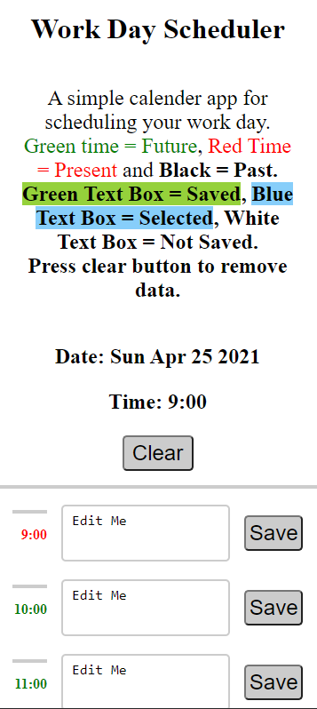
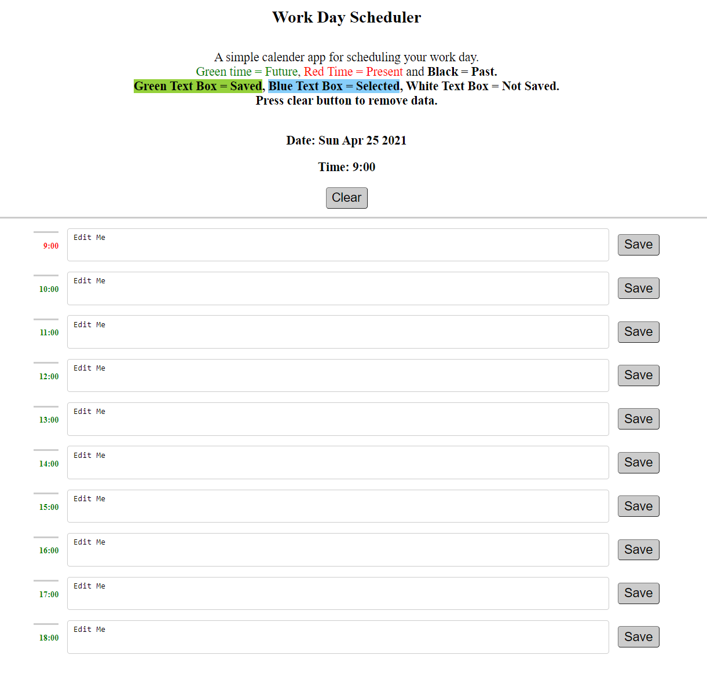

# ScheduleHa

## Link to Deplyed Application:
https://richoha.github.io/scheduleHa

## Link to GitHub:
https://github.com/RichoHa/scheduleHa

## List of Technology Used:
- Utilises local storage to remember and saves user's tasks when save buttons are pressed.
- Uses time and colour to tell users what time has passed.
- CSS Flex and Block to make a responsive website.
- Easy templated format to make expanding the webiste easy.
- Utilised Hover feature for a more responsive website. 
- Chose simple colors which is easy to look at.
- Utilised a clean looking font. 

## Purpose of the website:
The purpose of the website is to allow people to input tasks for the day and save it.  
Users are able to re-load the page and have their saved task still showing.  
It is made clear when a task has been saved by the box turning green.  
The page also shows users what is left for the day.  

## Web Application Mobile ScreenShot

## Web Application Desktop ScreenShot

## Collaborators
Richard (Duc) Ha: 0404 545 580 or Richard.dqh@gmail.com.